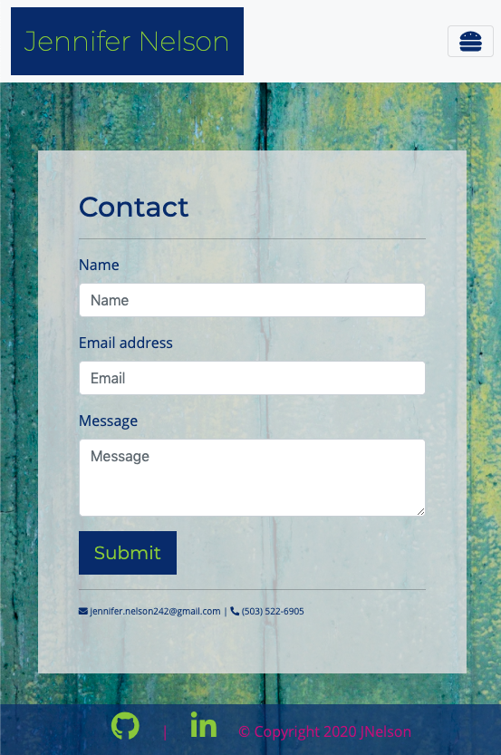
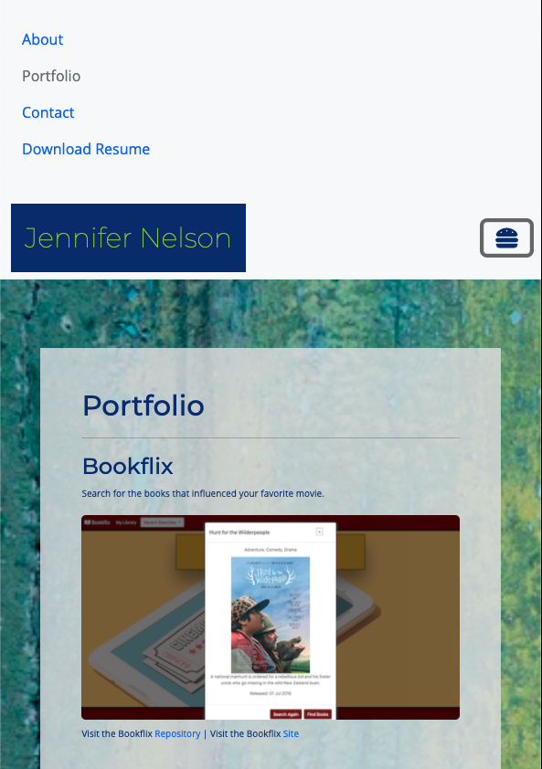

# Jennifer Nelson - Portfolio

## Description

A mobile responsive portfolio created with Bootstrap CSS Framework, custom CSS stylings, and powered by JavaScript

## Languages

HTML, CSS, JavaScript

## Resources

1. [Bootstrap](https://getbootstrap.com/)
2. [Google Fonts](https://fonts.google.com/)
3. [Unsplash](https://unsplash.com/)
4. [Font Awesome](https://fontawesome.com/)
5. [Intersection Observer Web API](https://www.w3.org/TR/intersection-observer/)

## Screenshots

Main portfolio page on large viewport:

Contact Me page on smaller viewport with collapsed navbar

Portfolio page on smaller viewport with external content (navigation links) revealed. This container expands and collapses when toggler icon is clicked.

## Link to Portfolio

[JNelson](https://jnel-221.github.io/jnelson/)
